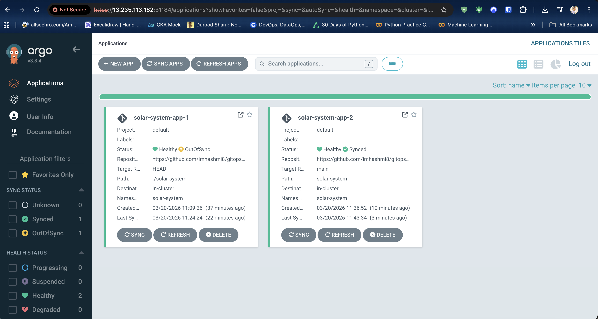
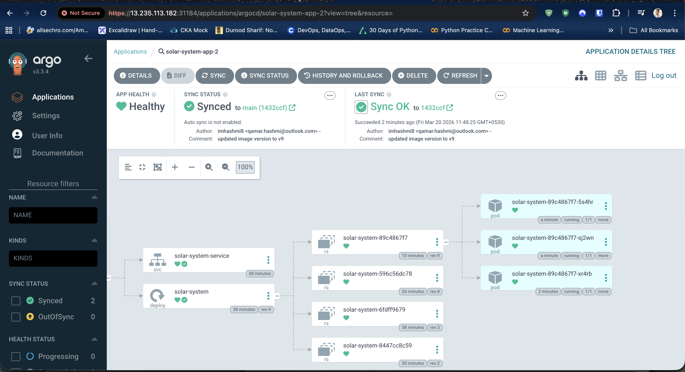
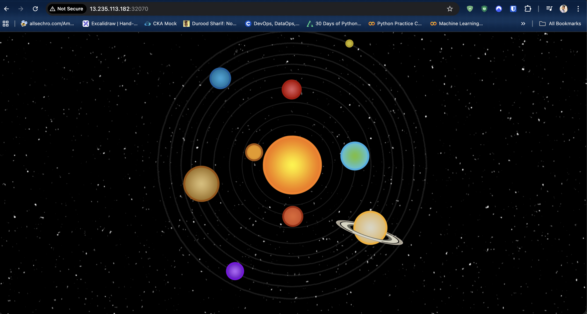
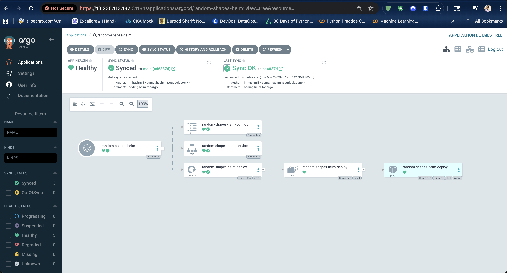
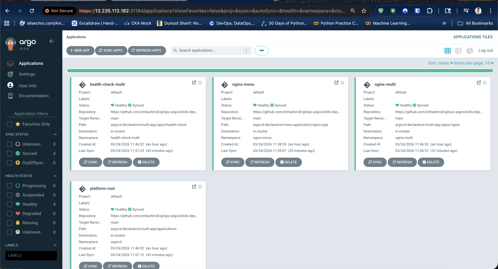
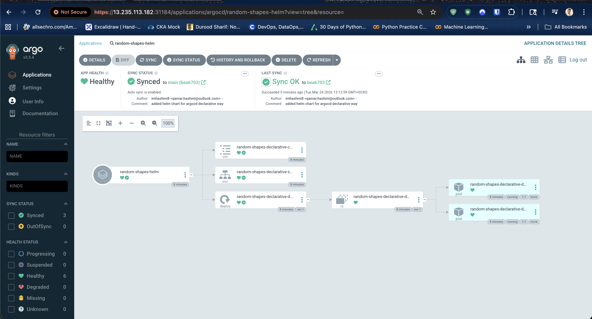

# Argo CD Setup Notes

This repository now has an EKS cluster running, and Argo CD was installed in the cluster.

## 1. Create the Argo CD namespace

```bash
kubectl create namespace argocd
```

## 2. Install Argo CD HA manifests

```bash
kubectl apply -n argocd --server-side --force-conflicts -f https://raw.githubusercontent.com/argoproj/argo-cd/v3.3.4/manifests/ha/install.yaml
```

## 3. Change the Argo CD server service from `ClusterIP` to `NodePort`

Edit the `argocd-server` service:

```bash
kubectl edit svc argocd-server -n argocd
```

Change:

```yaml
type: ClusterIP
```

to:

```yaml
type: NodePort
```

Then save the service and note the assigned NodePort.

## 4. Get the initial Argo CD admin password

```bash
kubectl -n argocd get secret argocd-initial-admin-secret \
  -o jsonpath="{.data.password}" | base64 --decode && echo
```

Default username:

```text
admin
```

## 5. Log in to the Argo CD UI

Open the Argo CD UI in the browser using:

```text
http://<node-ip>:<nodeport>
```

Use:

- Username: `admin`
- Password: output from `argocd-initial-admin-secret`

Argo CD applications overview:



## 6. Reset the password

After logging in, open the user info/profile console in the Argo CD UI and reset the admin password.

## 7. SSH into an EKS worker node

Use the EC2 key pair private key and connect to one of the worker node public IPs:

```bash
chmod 400 ~/.ssh/qamar-key-pair.pem
ssh -i ~/.ssh/qamar-key-pair.pem ec2-user@<node-public-ip>
```

## 8. Install the Argo CD CLI on the node

Download the Argo CD CLI binary:

```bash
wget https://github.com/argoproj/argo-cd/releases/download/v3.3.4/argocd-linux-amd64
mv argocd-linux-amd64 argocd
sudo chmod +x argocd
sudo mv argocd /usr/local/bin
```

Verify installation:

```bash
argocd version --client
```

## 9. Log in to Argo CD from the node using the CLI

Use the Argo CD server ClusterIP:

```bash
argocd login 10.100.79.219
```

Because the TLS certificate does not include the ClusterIP as an IP SAN, the CLI prompts for insecure access:

```text
WARNING: server certificate had error: error creating connection: tls: failed to verify certificate: x509: cannot validate certificate for 10.100.79.219 because it doesn't contain any IP SANs. Proceed insecurely (y/n)? yes
Username: admin
Password:
'admin:login' logged in successfully
Context '10.100.79.219' updated
```

When prompted:

- Enter `yes` to proceed insecurely
- Use username `admin`
- Use the password from `argocd-initial-admin-secret` or the updated password if it was already reset

## 10. Add the GitHub repository in the Argo CD UI

Log in to the Argo CD UI, then:

1. Go to **Settings**.
2. Open **Repositories**.
3. Click **Connect Repo**.
4. Choose the connection method:

For a public GitHub repository:

- Select **VIA HTTPS**
- Enter the repository URL
- Click **Connect**

Example:

```text
https://github.com/<github-username>/<repo-name>.git
```

For a private GitHub repository:

- Select **VIA HTTPS**
- Enter the repository URL
- Enter GitHub username
- Enter GitHub personal access token/password
- Click **Connect**

After a successful connection, the repository appears in the Argo CD repositories list.

## 11. Create an Argo CD application using the UI

In the Argo CD UI:

1. Click **NEW APP**.
2. Fill in the application details.

Recommended values:

- Application Name: `solar-system`
- Project Name: `default`
- Sync Policy: `Manual` or `Automatic`

Under **Source**:

- Repository URL: select the connected GitHub repository
- Revision: branch name such as `main`
- Path: repository folder containing Kubernetes manifests, for example `solar-system`

Under **Destination**:

- Cluster URL: `https://kubernetes.default.svc`
- Namespace: target namespace where the app should be deployed

Then:

1. Click **Create**.
2. Open the application.
3. Click **Sync**.
4. Confirm the sync to deploy the manifests.

After sync completes, Argo CD shows the application status, health, and Kubernetes resources created from the GitHub repository.

Argo CD application details tree:



Example solar system application UI:



## 12. Add the GitHub repository and create the application using the Argo CD CLI

After logging in with the Argo CD CLI, add the GitHub repository if needed:

For a public repository:

```bash
argocd repo add https://github.com/imhashmi8/gitops-argocd-k8s-deployment.git
```

For a private repository:

```bash
argocd repo add https://github.com/imhashmi8/gitops-argocd-k8s-deployment.git \
  --username <github-username> \
  --password <github-personal-access-token>
```

Create the target namespace if it does not already exist:

```bash
kubectl create namespace solar-system
```

Create the Argo CD application from the CLI:

```bash
argocd app create solar-system-app-2 \
  --repo https://github.com/imhashmi8/gitops-argocd-k8s-deployment.git \
  --path solar-system \
  --revision main \
  --dest-namespace solar-system \
  --dest-server https://kubernetes.default.svc
```

Sync the application:

```bash
argocd app sync solar-system-app-2
```

Check application status:

```bash
argocd app get solar-system-app-2
```

Example with an `nginx` application using automatic sync, auto-pruning, and self-healing:

```bash
argocd app create nginx-auto-sync \
  --repo https://github.com/imhashmi8/gitops-argocd-k8s-deployment.git \
  --path nginx \
  --revision main \
  --dest-namespace nginx \
  --dest-server https://kubernetes.default.svc \
  --sync-policy automated \
  --auto-prune \
  --self-heal
```

This configuration means:

- `--sync-policy automated`: Argo CD syncs changes from Git automatically
- `--auto-prune`: resources removed from Git are also removed from the cluster
- `--self-heal`: resources changed manually in the cluster are reconciled back to the Git state

### Helm chart using the Argo CD CLI

Argo CD can also deploy the Helm chart in this repository by pointing the application to the `helm-chart/` directory.

Create the application:

```bash
argocd app create random-shapes-helm \
  --repo https://github.com/imhashmi8/gitops-argocd-k8s-deployment.git \
  --path helm-chart \
  --revision main \
  --dest-server https://kubernetes.default.svc \
  --dest-namespace helm-demo \
  --sync-policy automated \
  --auto-prune \
  --self-heal \
  --sync-option CreateNamespace=true
```

Sync and verify it:

```bash
argocd app sync random-shapes-helm
argocd app get random-shapes-helm
```

This imperative Helm example uses:

- `path: helm-chart` so Argo CD detects the Helm chart from `Chart.yaml`
- `helm-demo` as the destination namespace
- `CreateNamespace=true` so the namespace is created automatically
- automated sync with pruning and self-healing

### Helm chart imperative view in Argo CD

Add the screenshot for the imperative Helm deployment at:

- `images/argocd-helm-imperative-overview.png`



## 13. Declarative Argo CD examples

This repository now shows two declarative Argo CD patterns under `argocd-declarative/`.

### Mono application example

The mono application pattern is the simplest declarative Argo CD setup. One Argo CD `Application` resource manages one workload.

In this repository, the mono example manages a single `nginx` workload in the `nginx-mono` namespace.

Why this pattern is needed:

- it is easy to understand and a good starting point for learning Argo CD
- it works well when you want to deploy one application independently
- it keeps Git structure simple because one application points directly to one manifest directory
- it is useful for smaller projects, demos, and teams managing apps one by one

Structure:

- `argocd-declarative/mono-application/nginx/app/`: Kubernetes manifests for the app
- `argocd-declarative/mono-application/nginx/application.yml`: Argo CD `Application` manifest

Key files:

- [`argocd-declarative/mono-application/nginx/app/deployment.yml`](argocd-declarative/mono-application/nginx/app/deployment.yml)
- [`argocd-declarative/mono-application/nginx/app/service.yml`](argocd-declarative/mono-application/nginx/app/service.yml)
- [`argocd-declarative/mono-application/nginx/application.yml`](argocd-declarative/mono-application/nginx/application.yml)

Apply it with:

```bash
kubectl apply -f argocd-declarative/mono-application/nginx/application.yml
```

### Multi-app example

The multi-app example uses the app-of-apps pattern. A parent Argo CD `Application` manages multiple child Argo CD applications.

In this repository, the root application points to child applications for:

- `nginx` in the `nginx-multi` namespace
- `health-check` in the `health-check-multi` namespace

Why this pattern is needed:

- it helps manage multiple applications from one entry point
- it is useful for platform teams or environments where many apps must be organized together
- it makes it easier to group related applications for a cluster, team, or environment
- it scales better than creating and tracking many standalone applications manually
- it supports a cleaner GitOps structure when you want central control over child apps

Structure:

- `argocd-declarative/multi-app/apps/`: Kubernetes manifests for each workload
- `argocd-declarative/multi-app/applications/`: child Argo CD `Application` manifests
- `argocd-declarative/multi-app/root-application.yml`: parent Argo CD `Application`

Key files:

- [`argocd-declarative/multi-app/applications/nginx.yml`](argocd-declarative/multi-app/applications/nginx.yml)
- [`argocd-declarative/multi-app/applications/health-check.yml`](argocd-declarative/multi-app/applications/health-check.yml)
- [`argocd-declarative/multi-app/root-application.yml`](argocd-declarative/multi-app/root-application.yml)

Apply it with:

```bash
kubectl apply -f argocd-declarative/multi-app/root-application.yml
```

Both examples use:

- `prune: true` to remove resources no longer defined in Git
- `selfHeal: true` to reconcile drift back to the Git state
- `CreateNamespace=true` so Argo CD creates the destination namespace automatically
- the Argo CD `Application` destination namespace as the single source of truth for where workloads are deployed

When to use which:

- use `mono application` when you want one Argo CD app per workload and prefer a simpler setup
- use `multi-app` when you want one parent application to manage multiple child applications in a structured way

### Mono and multi-app view in Argo CD

The Argo CD UI below shows both declarative examples:

- `nginx-mono` as the mono application example
- `platform-root` as the parent app in the multi-app example
- `nginx-multi` and `health-check-multi` as child applications managed by the multi-app pattern



## 14. Declarative Helm example

Argo CD can also deploy a Helm chart declaratively by using an Argo CD `Application` manifest that points to the chart directory in Git.

Why this is useful:

- it lets you keep Helm-based deployments in the same GitOps workflow as plain YAML applications
- Argo CD renders the Helm chart and applies the generated Kubernetes manifests automatically
- you still get automated sync, pruning, self-healing, and Git-based history

This repository includes a separate declarative Helm example with its own chart, values file, and namespace so it stays independent from the imperative Helm example.

Structure:

- `argocd-declarative/helm-application/random-shapes/chart/`: the declarative Helm chart source
- `argocd-declarative/helm-application/random-shapes/application.yml`: Argo CD `Application` for the Helm chart

Key files:

- [`argocd-declarative/helm-application/random-shapes/chart/Chart.yaml`](argocd-declarative/helm-application/random-shapes/chart/Chart.yaml)
- [`argocd-declarative/helm-application/random-shapes/chart/values.yaml`](argocd-declarative/helm-application/random-shapes/chart/values.yaml)
- [`argocd-declarative/helm-application/random-shapes/application.yml`](argocd-declarative/helm-application/random-shapes/application.yml)

Apply it with:

```bash
kubectl apply -f argocd-declarative/helm-application/random-shapes/application.yml
```

This declarative example points Argo CD to:

- `path: argocd-declarative/helm-application/random-shapes/chart` so Argo CD detects and renders the dedicated declarative Helm chart
- `valueFiles: [values.yaml]` to use the chart values stored with this example
- `releaseName: random-shapes-declarative` to give the Helm release a stable name
- `namespace: helm-declarative` as the destination namespace

### Helm chart declarative view in Argo CD

Add the screenshot for the declarative Helm deployment at:

- `images/argocd-helm-declarative-overview.png`


